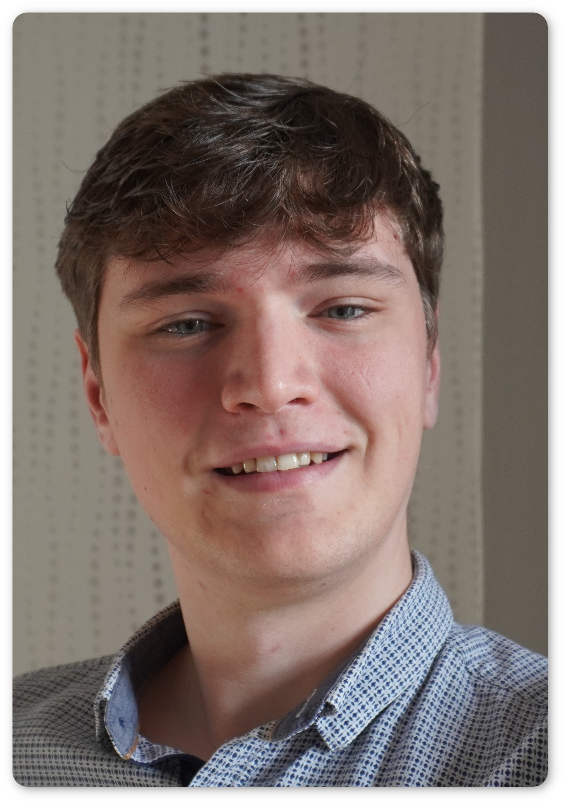

# Who am I!
I am Jules EVANS and I am currently doing a PhD at Irit.
The title is "Energy-aware HPC Scheduling", that is to say I work with HPC cluster RJMSs (Resource and Job Management Software).
I am trying to make them minimise energy consumption and carbon emissions rather than completion time.

### Supervisors :
 - Georges DA COSTA
 - Patricia STOLF

# My Journey
 - After high school, I went to what the french call "class prépa" which is really intense math, physics and engineering courses.
 At the end of the tow years, the students undergo a competition for engineering schools. The first gets to choose first and so on and so forth.
 - I landed in Bordeaux at Enseirb-Matméca in the Comp-Sci departement.
 - I had the opportunity to study one semester in Valparaíso, Chile and to do an intership in Osaka, Japan.
 - I specialized in HPC (High Performance Computing).

# Hobbies
I play the flute and really like board and video games. I also dable in chess.
